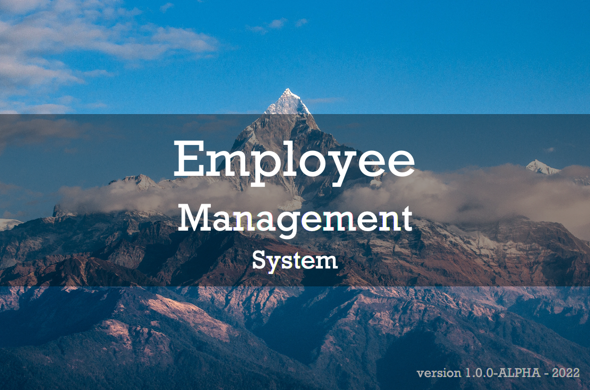
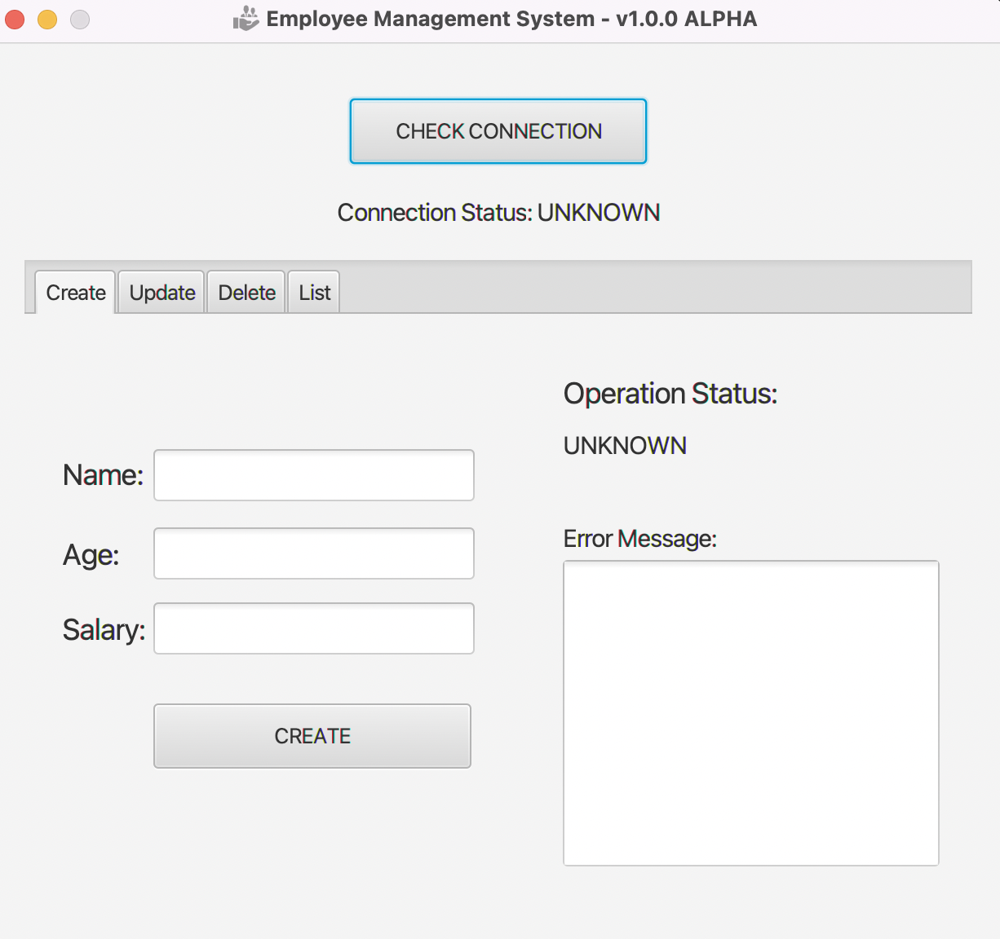
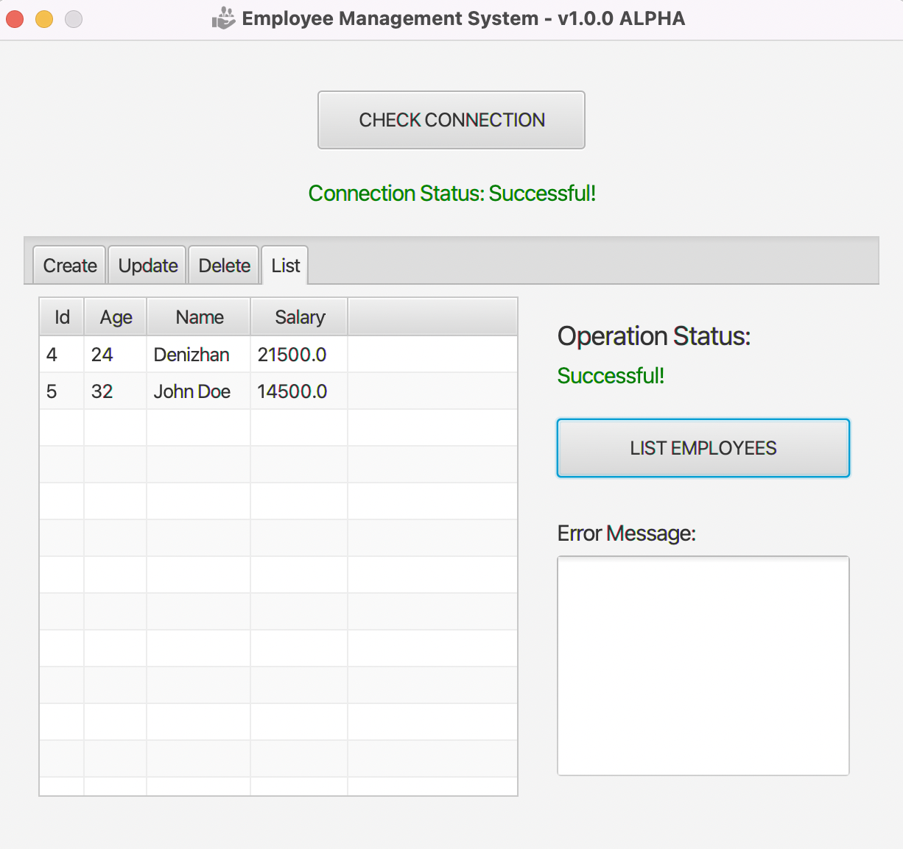
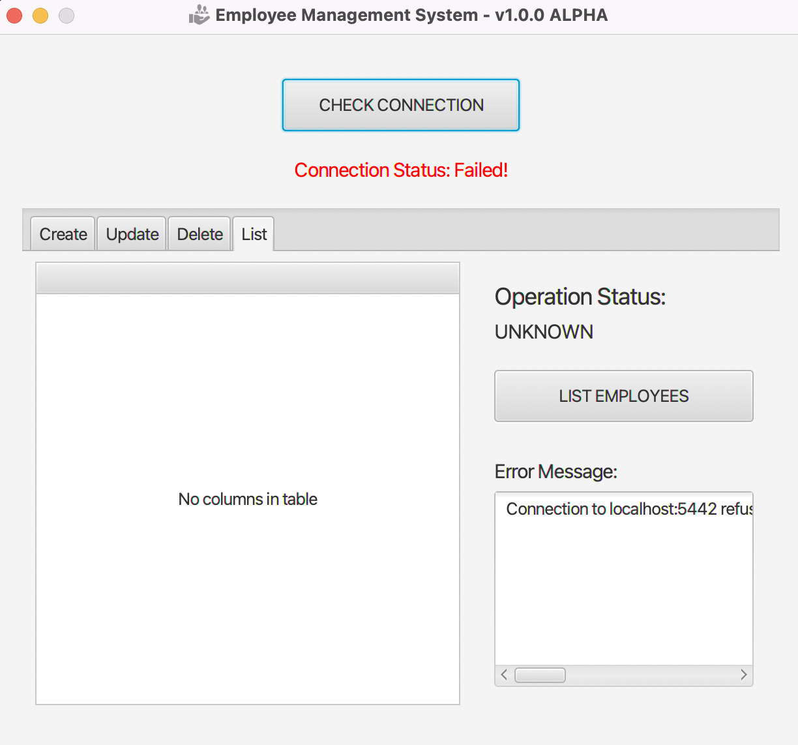

# Employee Management System

- JavaFX, Postgres, JDBC
- Employee Management System is an app which includes CRUD operations for Employees.
- Error Messages can be seen at each tab.
- Standalone jar can be found at project's root folder.
- Postgres serves at `http://localhost:5442`.
- To run Postgres at local:
    - Find `Makefile` which is inside `/config`:
        - Run `postgres_run` goal.
- You can then run standalone jar file with the command:
  - `java -jar employeeSystem-1.0.0-ALPHA.jar`

### Splash Screen

### Create Screen

### List Screen

### Error Screen

